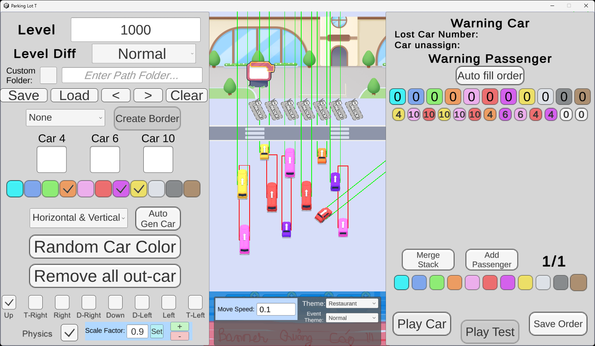
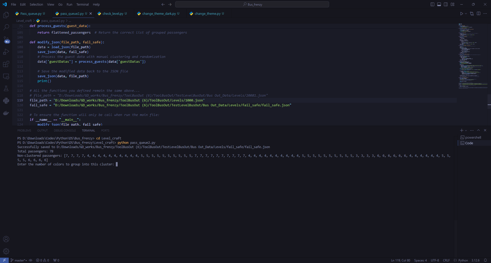
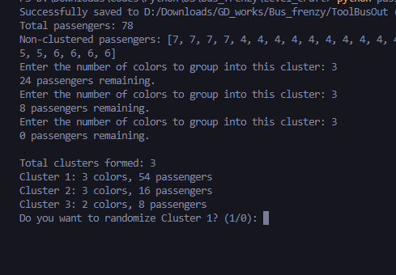
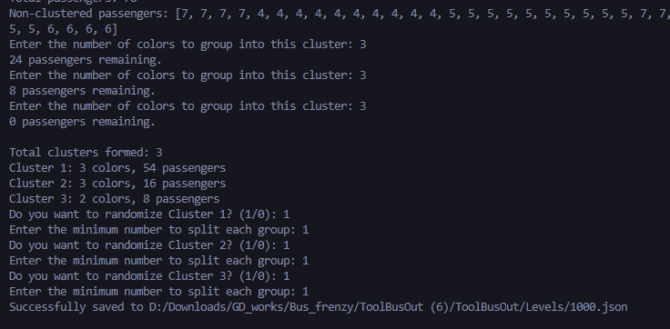
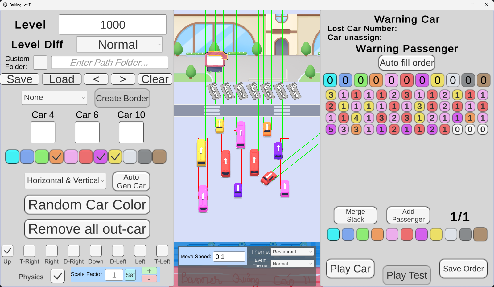

# Hướng dẫn sử dụng:

1. Download file
2. Trong máy, sau khi xếp xong layout (thường xếp tầm 5+ màu), playcar xong, nhấn save order xong và save file:

3. Mở script lên, sửa các đường dẫn: file_path là path tới file level vừa save, fail_safe là file để đề phòng chạy script lỗi gì thì back về trạng thái vừa playcar với save order xong được
4. Chạy script, sẽ hiển thị các biến: total passengers, và hàng khách (hiển thị theo mã màu)

5. Script cho phép chia hàng khách thành các cụm, mỗi cụm có số màu riêng biệt tùy vào user nhập khi được hỏi "Enter the number of colors to group into this cluster:". Nhập xong, nhấn enter sẽ hiển thị số khách chưa được group vào cluster -> cứ tiếp tục chia như vậy cho đến khi hết khách. Thường ban đầu level dễ sẽ chia thành các cluster 3 màu, giữa/ cuối level khó thì lồng 1 2 cluster 4 màu vào tăng thử thách...
6. Sau khi chia thành các cluster, sẽ hiển thị tổng số cluster, số khách mỗi cluster, số màu mỗi cluster. Sau đó đi từng cluster một từ đầu đến cuối, hỏi user có muốn random trong cluster đó ko

Nhấn 1 để có random, 0 để bỏ qua, tự xếp tay lại
7. Nếu nhấn 1, script sẽ hỏi muốn chia cluster thành từng khoảng nhỏ nhất bao nhiêu user để random, tức là tráo vị trí của các user. Thường chọn là 1 -> random vị trí của từng passengers trong mỗi cluster. Xong sẽ hiển thị đã save xong như hình

8. Mở tool test/ tool xếp lên test xem level đã ổn chưa, xong tune lại cho đúng ý -> nếu mở tool lên ko load được level là do script chạy lỗi, nên lưu level bị sai -> tool ko đọc được file level. Nếu cần thì tìm file failsafe.json để lấy lại file level sau khi play car và save order

